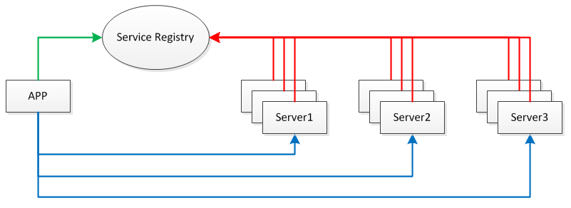
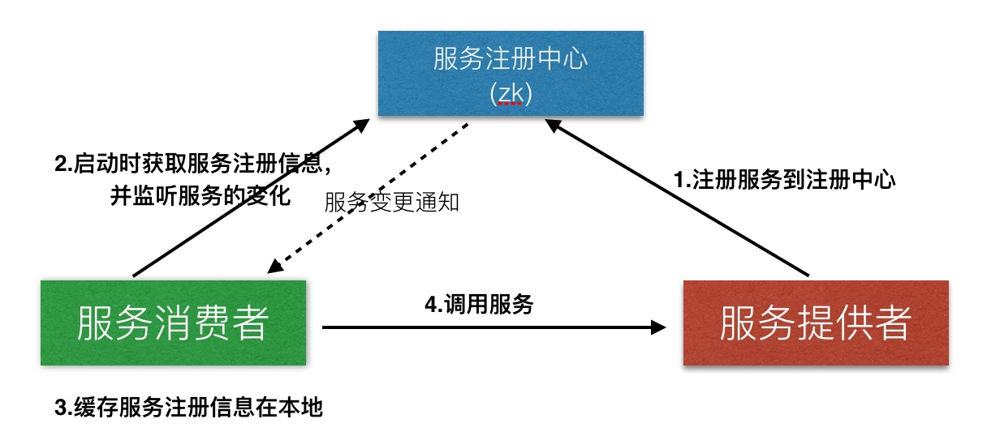

# 通过 Spring + Netty + Protostuff + ZooKeeper 实现了一个轻量级 RPC 框架

* RPC，即 Remote Procedure Call（远程过程调用），说得通俗一点就是：调用远程计算机上的服务，就像调用本地服务一样。

* RPC 可基于 HTTP 或 TCP 协议，Web Service 就是基于 HTTP 协议的 RPC，它具有良好的跨平台性，但其性能却不如基于 TCP 协议的 RPC。会两方面会直接影响 RPC 的性能，一是传输方式，二是序列化。

* 众所周知，TCP是传输层协议，HTTP是应用层协议，而传输层较应用层更加底层，在数据传输方面，越底层越快，因此，在一般情况下，TCP 一定比 HTTP 快。就序列化而言，Java 提供了默认的序列化方式，但在高并发的情况下，这种方式将会带来一些性能上的瓶颈，于是市面上出现了一系列优秀的序列化框架，比如：Protobuf、Kryo、Hessian、Jackson 等，它们可以取代 Java 默认的序列化，从而提供更高效的性能。

* 为了支持高并发，传统的阻塞式IO显然不太合适，因此我们需要异步的IO，即NIO。Java提供了NIO的解决方案，Java7也提供了更优秀的 NIO.2 支持，用 Java 实现 NIO 并不是遥不可及的事情，只是需要我们熟悉 NIO 的技术细节。

* 我们需要将服务部署在分布式环境下的不同节点上，通过服务注册的方式，让客户端来自动发现当前可用的服务，并调用这些服务。这需要一种服务注册表（Service Registry）的组件，让它来注册分布式环境下所有的服务地址（包括：主机名与端口号）。

### 应用、服务、服务注册表之间的关系见下图：

  - 

* 每台Server上可发布多个Service，这些Service共用一个host与port，在分布式环境下会提供Server共同对外提供 Service。此外，为防止 Service Registry 出现单点故障，因此需要将其搭建为集群环境。

* 本文将为您揭晓开发轻量级分布式RPC框架的具体过程，该框架基于TCP协议，提供了NIO特性，提供高效的序列化方式，同时也具备服务注册与发现的能力。
* Spring：它是最强大的依赖注入框架，也是业界的权威标准。
* Netty：它使NIO编程更加容易，屏蔽了Java底层的NIO细节。
* Protostuff：它基于 Protobuf序列化框架，面向POJO，无需编写.proto文件。
* ZooKeeper：提供服务注册与发现功能，开发分布式系统的必备选择，同时它也具备天生的集群能力。

# 基于Zookeeper的服务注册与发现(转自：https://tech.imdada.cn/2015/12/03/service-registry-and-discovery-with-zk/)

  - 

* 在此架构中有三类角色：服务提供者，服务注册中心，服务消费者。

###服务提供者

* 服务提供者作为服务的提供方将自身的服务信息注册到服务注册中心中。服务信息包含：
    1.隶属于哪个系统
    2.服务的IP，端口
    3.服务的请求URL
    4.服务的权重等等

###服务注册中心

* 服务注册中心主要提供所有服务注册信息的中心存储，同时负责将服务注册信息的更新通知实时的Push给服务消费者（主要是通过Zookeeper的Watcher机制来实现的）。

###服务消费者

* 服务消费者主要职责如下：
    1.服务消费者在启动时从服务注册中心获取需要的服务注册信息
    2.将服务注册信息缓存在本地
    3.监听服务注册信息的变更，如接收到服务注册中心的服务变更通知，则在本地缓存中更新服务的注册信息
    4.根据本地缓存中的服务注册信息构建服务调用请求，并根据负载均衡策略（随机负载均衡，Round－Robin负载均衡等）来转发请求
    5.对服务提供方的存活进行检测，如果出现服务不可用的服务提供方，将从本地缓存中剔除

* 服务消费者只在自己初始化以及服务变更时会依赖服务注册中心，在此阶段的单点故障通过Zookeeper集群来进行保障。在整个服务调用过程中，服务消费者不依赖于任何第三方服务。
